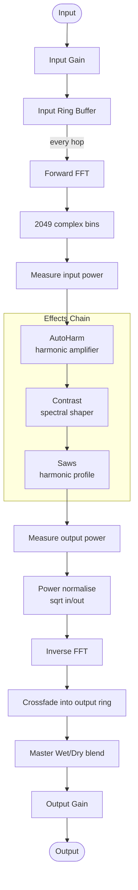

# CognitoniBlkFx


CognitoniBlkFx is a spectral FX plugin built with JUCE, reimplementing the classic **DtBlkFx** by Darrell Tam. It uses the same crossfade-output block processing architecture as the original, operating on overlapping FFT frames without windowing.

## Downloads
- **TODO:** Once I get the current features adjusted correctly I'll create built versions for VST3

## Credits
- Original DtBlkFx algorithm and design: **Darrell Tam**
- Also thanks to **Dan Smith** for refactoring and making the DtBlkFx source code for public consumption.

## Audio Processing Architecture

The engine processes audio in overlapping spectral frames. Each frame is written back to the output ring using a linear crossfade over the overlap region (mirroring `DtBlkFx::mixToX3`), which eliminates the amplitude modulation artefact that standard overlap-add (OLA) produces at the hop rate.

```
FFT size   : 4096 samples
Hop size   : 2351 samples  (≈ 42.6 % overlap)
Overlap    : 1745 samples  (crossfaded)
Latency    : 4096 samples  (≈ 93 ms @ 44.1 kHz)
Output ring: 3 × 4096 = 12288 samples
```

### Signal-flow diagram



## Effects

### AutoHarm
Detects the fundamental pitch of the input and applies amplitude shaping to its harmonic series. The frequency range controls which part of the spectrum is searched for the fundamental. The type selector chooses which harmonics are targeted (All, Odd, Even, or Between) and the value knob controls harmonic band width. The dB knob sets the amplitude multiplier applied to each matched harmonic bin.

### Contrast
Applies a nonlinear spectral power curve across all bins in the frequency band. Positive values exaggerate differences between loud and quiet partials; negative values compress them toward equal amplitude. Output power is normalised to match input power after the transformation.

### Saws
Shapes the harmonic content toward a sawtooth-wave profile using pre-computed coefficient tables ported directly from DtBlkFx. The value knob selects between **Scale** mode (blends existing harmonics toward the sawtooth spectrum) and **Copy** mode (replaces each harmonic from a scaled copy of the fundamental amplitude).

## Features

- Three spectral processing cards: **AutoHarm**, **Contrast**, **Saws**
- Per-card bypass, frequency range (Freq A / Freq B), harmonic type selector, value, and dB controls
- Input and output gain trims (±18 dB)
- Master Wet/Dry for global dry/processed blend
- Proportionally scalable UI — resize the window and all text and controls scale with it
- Built-in presets including the classic DtBlkFx AutoHarm preset with matching parameters
- User presets saved to `%APPDATA%\CognitoniBlkFx\presets.json` (Windows)

## Build Instructions

### Prerequisites

- [JUCE](https://juce.com) and Projucer
- **Windows**: Visual Studio 2022
- **macOS**: Xcode
- **Linux**: GCC or Clang

### Windows

1. Open `CognitoniBlkFx.jucer` in Projucer.
2. Verify your JUCE module paths in Projucer global settings.
3. Save/export the project from Projucer to regenerate `Builds/` and `JuceLibraryCode/`.
4. Open `Builds/VisualStudio2022/CognitoniBlkFx.sln` in Visual Studio.
5. Build `Debug` or `Release` for `x64`.

### macOS / Linux

Follow the same Projucer -> IDE -> build flow for your platform.

## Project Structure

- `CognitoniBlkFx.jucer` — Projucer project file
- `Source/` — Plugin source code
  - `SpectralEngine/` — Crossfade-output FFT processing engine (`FFTProcessor`)
  - `Cards/` — AutoHarm, Contrast, and Saws spectral card implementations
  - `PluginProcessor.cpp/.h` — JUCE audio processor, APVTS, preset management
  - `PluginEditor.cpp/.h` — JUCE plugin editor / UI

## License

GNU General Public License v3.0 or later. See `LICENSE`.
